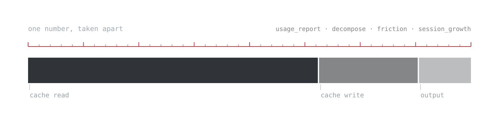

<picture>
  <source media="(prefers-color-scheme: dark)" srcset="assets/banner-dark.svg">
  
</picture>

# claude-code-measure-efficiency

*Above: the idea, not a result. One aggregate number separated into the parts that explain it. The bands are drawn equal on purpose, because nothing in this image is a measurement.*

Measure how efficiently you use Claude Code. Four local scripts read the transcripts Claude Code already writes to disk and report where your tokens go: model tier mix, cache economics, cost per unit of work, per-session context growth, and rework signals. Run them on their own to judge your current usage, or before and after a configuration change to verify that an optimization actually worked.

Most published Claude Code optimization guides assert a saving. Few provide a way to verify one. This repository contains the measurement scripts, the optimization setup that was evaluated with them (a seven-agent model-tiering configuration in `setup/`), and the reference results from that evaluation. The results below include both the effects that were confirmed and the effect that was not.

Everything runs locally. The scripts read `~/.claude/projects/**/*.jsonl`, transmit nothing, and print aggregate counts only. No conversation content is written to output.

## Contents

```
tools/usage_report.py     token mix by model tier, cache economics, subagent dispatch counts
tools/decompose.py        cost per unit of work, split into four components
tools/friction.py         rework proxies: tool errors, correction rate, edit churn
tools/session_growth.py   per-session context growth and cost concentration
setup/                    the seven-agent configuration and policy blocks that were measured
```

## Requirements

Python 3.8 or later. No dependencies. Claude Code must have written session transcripts to `~/.claude/projects/`.

## Usage

```bash
python3 tools/usage_report.py                    # last 14 days
python3 tools/usage_report.py --since 2026-08-03  # compare two periods
python3 tools/decompose.py 2026-08-03             # cost decomposition across a change date
python3 tools/friction.py 2026-08-03              # rework proxies across a change date
python3 tools/session_growth.py                   # per-session context growth, last 14 days
```

Pass the date a configuration change took effect. Each script splits the transcript history into a before period and an on/after period.

## Units

Cost-equivalent is computed by applying published API list rates to observed token counts. It is a comparison unit between periods. It is not a bill and does not represent subscription pricing. Rates are defined at the top of each script and should be updated when list prices change.

Cache reads are priced at 0.1x the input rate. Cache writes are priced at 1.25x. Both are configurable constants.

## Reference results

One user, one machine. Baseline period of 41 days and 112 sessions. Measurement period of 10 days and 51 sessions. The change under evaluation was the introduction of the agent configuration in `setup/`, which routes mechanical work to lower-cost model tiers.

These figures were recomputed on 2026-08-14 after two defects were found in how the scripts assigned work to periods. See [Correction](#correction) below.

### Adoption

The configuration was adopted in practice rather than remaining unused.

| Metric | Baseline | After |
|---|---|---|
| Fleet subagent dispatches | 2 of 124 | 60 of 86 |
| Built-in Explore dispatches | 43 | 8 |
| Sonnet and Haiku share of tokens | 1.7% | 5.9% |
| Highest-cost tier share of tokens | 28.7% | 6.3% |
| Cache hit rate | 96.2% | 97.2% |

### Cost decomposition

Cost is normalized by output tokens so that periods of different volume are comparable. Splitting the total into components separates the effect of model tiering from other effects.

| Component | Baseline | After | Change |
|---|---|---|---|
| Output tokens | 32.7 | 26.5 | −19% |
| Cache writes | 60.2 | 60.1 | 0% |
| Fresh input | 0.4 | 0.0 | −91% |
| Cache reads | 127.4 | 143.1 | +12% |
| **Total** | **220.6** | **229.7** | **+4.1%** |

Output tokens, the component most directly exposed to model tiering, fell 19%. Fresh input fell to almost nothing. Cache writes did not move. Cache reads, which model tiering does not act on, rose 12%, and because they are the largest single component the net result was an increase of 4.1%.

Cache reads accounted for 57.7% of cost in the baseline period and 62.3% after. Cache read per turn rose from 0.22M to 0.25M, an increase of 14%.

**The cause of that increase is not established.** Two candidate explanations were tested against this dataset and neither survived. Sessions did not get longer: turns per session fell from 493 to 459, and the median main-thread session fell from 241 turns to 224. Fixed per-turn overhead did not grow either: the smallest cache read in a session, which approximates the system prompt, tool definitions and instruction files that every turn re-reads, moved 1%. What remains is that each turn added more transcript than it used to at an unchanged turn count, and this dataset does not say why.

Holding cache read per unit at its baseline value produces a total of 214.0, or −3.0%. That figure is a model rather than a measurement.

`tools/session_growth.py` reports cost per session, so sessions that grew past their task are visible individually.

### Rework proxies

Reported per turn, because turn counts differed between periods.

| Signal | Baseline | After | Change |
|---|---|---|---|
| Tool error rate | 3.40% | 2.86% | −16% |
| Tool errors per turn | 0.0175 | 0.0158 | −10% |
| Correction rate per turn | 0.00127 | 0.00086 | −32% |
| Edit churn | 86.7% | 80.3% | −6.4 points |

Correction rate is the fraction of human turns matching a regex for correction language, for example "that is wrong", "does not work", "revert", "you missed". It is a proxy for the operator judging output to be incorrect. Measured per human turn rather than per assistant turn, the correction rate rose from 2.35% to 2.54%, so this signal is not consistent across denominators and should be read as weak.

### Summary

Confirmed: the configuration was adopted, displaced the built-in Explore agent, shifted work to lower-cost tiers, cut output tokens per unit of work by 19%, and coincided with lower measured rework.

Not confirmed: a net reduction in total cost. Net cost per unit of work rose 4.1%, driven by a 12% rise in cache reads whose cause this dataset does not identify.

## Correction

Published 2026-08-08, corrected 2026-08-14. Two defects in period assignment were found and fixed. Both inflated the apparent change rather than the reverse, and one produced a headline finding that was wrong.

**Sessions were bucketed by file modification time.** Resuming an old session updates its mtime, so long-lived sessions were sorted into the later period regardless of when they began. Because long sessions are exactly the ones most likely to be resumed, this systematically loaded the measurement period with the longest sessions in the dataset.

**Transcript files were counted as sessions.** One session writes several files, including one per subagent run. Files per session was 4.9 in the baseline and 2.9 afterward, so per-file turn counts rose between periods even though sessions did not get longer.

Together these produced the original claim that average session length grew 60%, from 132 to 213 turns. Bucketing by the first record timestamp and grouping files by session id, session length fell about 7%. **That claim is withdrawn**, along with the conclusion drawn from it, that session length governs cost more than model selection does. This dataset does not support it.

Corrected in the same pass: cache writes were reported as −15% and are flat, and the statement that every component model tiering acts on fell 15% to 18% was true only of output tokens. Adoption and rework were understated rather than overstated: Explore displacement was 43 to 8 rather than 46 to 8, fleet dispatch share 2% to 70% rather than 1% to 47%, and corrections per turn −32% rather than −22%.

The scripts in `tools/` now bucket by session start time and group by session id, so they reproduce the figures above.

## Limitations

1. Sample size is one user, one workload, ten days of measurement against a 41 day baseline. These results indicate direction, not magnitude, and are not generalizable without replication.
2. The periods are not a controlled experiment. Workload composition differed. Some work during the measurement period was performed in a different tool and is absent from these transcripts, which means the remaining Claude Code workload may not be comparable in difficulty. This confound is unquantified and could account for part of the +4.1%.
3. Cost-equivalent uses list API rates. A subscription user pays a fixed amount regardless. The figure compares periods; it does not report spend.
4. Output tokens are used as the proxy for work produced. This is crude. A refactor and a long explanation are not equivalent work at equal token counts.
5. The scripts parse an undocumented internal transcript format. Format changes will break them. They are best-effort and version-pinned to nothing.
6. Friction metrics measure friction, not correctness. Regex correction detection misses indirect phrasing and cannot detect defects the operator never noticed.
7. The counterfactual in the decomposition is a model, not a measurement.
8. The baseline is not stable across runs. Claude Code prunes old transcripts, so re-running these scripts weeks apart compares against a baseline that has lost its earliest days. A later run is not a clean extension of an earlier one, and a change in the headline figure between runs may be the baseline moving rather than the workload changing.
9. Period assignment uses the timestamp of a session's first record. A session that began before a change and continued well past it is counted entirely in the earlier period.

## The setup that was measured

See [`setup/`](setup/). It contains seven subagent definitions pinned to specific model tiers, and three policy blocks for `CLAUDE.md`. It is a small, deliberately curated configuration rather than a large library. Adoption data above suggests the curation matters: a smaller set of clearly differentiated agents was selected by the routing model in 70% of dispatches, where the prior state was 2%.

`setup/` is held fixed as the exact configuration these results describe. The fuller optimization stack, which adds tool-output filtering and session hygiene to model tiering and continues to change, is at [claude-code-token-optimization](https://github.com/makinggainz/claude-code-token-optimization). This repository is the evidence; that one is the configuration.

## License

MIT. See [LICENSE](LICENSE).
